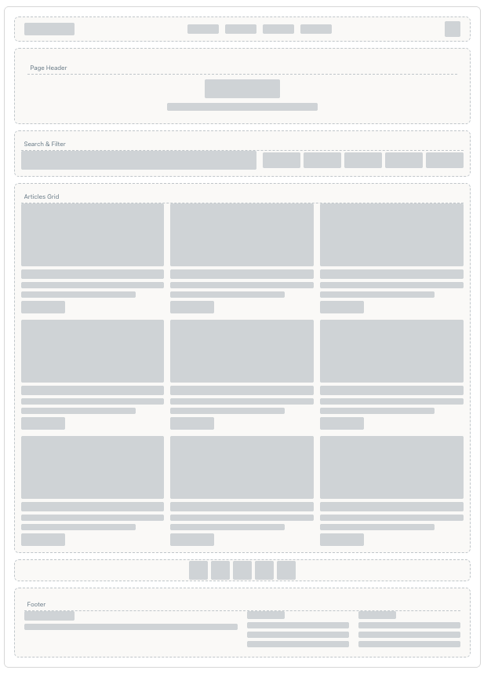
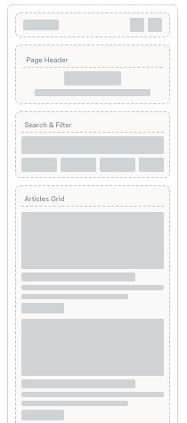
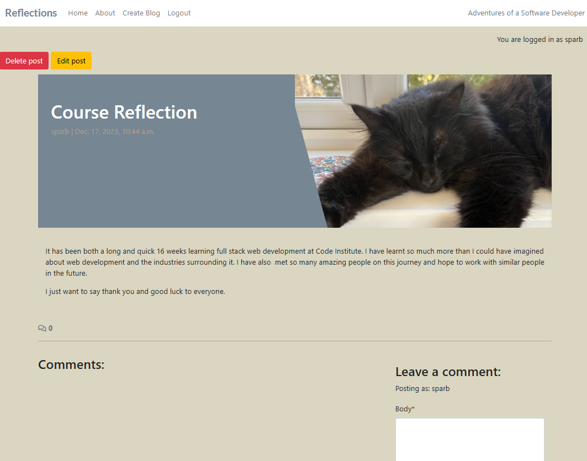
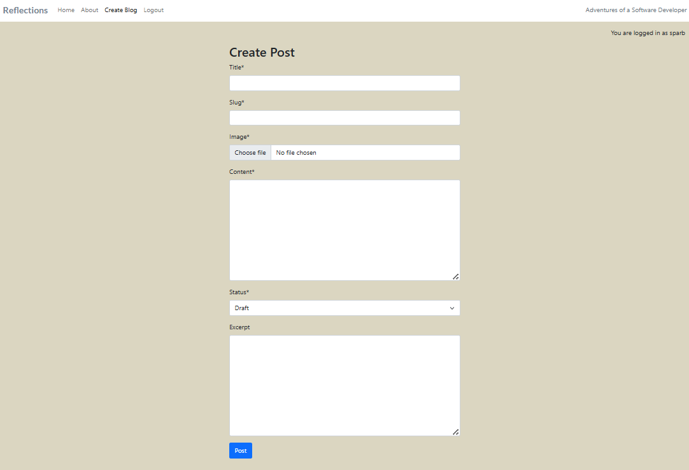
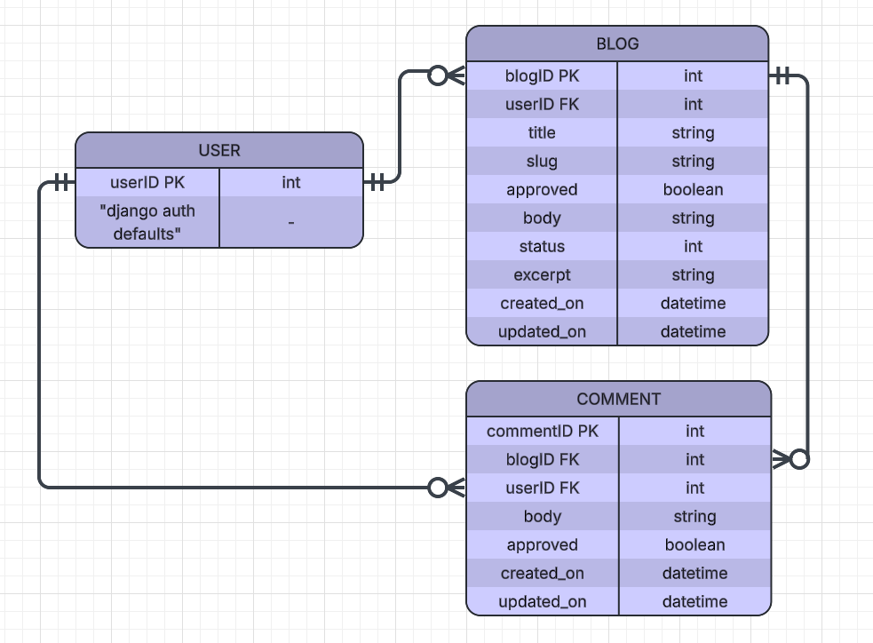

<!-- START doctoc generated TOC please keep comment here to allow auto update -->
<!-- DON'T EDIT THIS SECTION, INSTEAD RE-RUN doctoc TO UPDATE -->
**Table of Contents**

- [Reflections](#reflections)
  - [Table of Contents](#table-of-contents)
  - [Project Overview](#project-overview)
    - [User Experience (UX)](#user-experience-ux)
    - [User Stories](#user-stories)
      - [Must-Have Features](#must-have-features)
      - [Should-Have Features](#should-have-features)
      - [Could-Have Features](#could-have-features)
      - [Wont-Have Features](#wont-have-features)
  - [Early Design](#early-design)
    - [Wireframes](#wireframes)
  - [Features](#features)
    - [Landing Page](#landing-page)
    - [Navigation & User Experience](#navigation--user-experience)
    - [CRUD Features](#crud-features)
    - [Design Philosophy](#design-philosophy)
    - [Accessibility Features](#accessibility-features)
  - [Testing](#testing)
    - [Manual Testing](#manual-testing)
    - [Browser Testing](#browser-testing)
    - [Validator Testing](#validator-testing)
  - [Technologies Used](#technologies-used)
    - [Database Structure](#database-structure)
    - [Future Features](#future-features)
    - [Known Bugs](#known-bugs)
  - [Deployment Instructions](#deployment-instructions)

<!-- END doctoc generated TOC please keep comment here to allow auto update -->

# Reflections

A blog for sharing our reflections and insights on the full-stack code institute course.

You can access the blog [here](https://hackathon-fullstack-207046bedb7e.herokuapp.com).

## Project Overview

A website built using Django which allows users to share blogs about their Reflections on the Bootcamp and to comment on the Reflections shared. Our group were inspired to build Reflections by our experiences on the Bootcamp. Reflections is our Full Stack Hackathon project. This project uses and demonstrates a culmination of our learning  on the course.

Technologies and Methodologies used:

- PostgreSQL, integrated through Django - for Database Management
- HTML, CSS, JavaScript - for Frontend Development
- Python, Django framework - for Backend Development
- Cloudinary - for API
- Using AI tools, e.g. Copilot and  ChatGPT 4.0 in the planning and debugging process
- Agile methodology - for Project planning and tracking
- Git & GitHub - for Version Control
- Heroku - for deployment

## User Experience (UX)

### User Stories

#### Must-Have Features
1. As a Site User, I can click on a post so that I can read the full text.
2. As a Site User I can register an account so that I can comment on a post.
3. As a Site Admin I can create, read, update and delete posts so that I can manage my blog content
4. As a Site Admin I can create draft posts so that I can finish writing the content later
5. As a Developer I want to create a README.md so that anyone looking at the project has the required documentation.

#### Should-Have Features
1. As a site user, I can view a paginated list of posts so that I can select which post I want to view.
2. As a Site User / Admin I can view comments on an individual post so that I can read the conversation
3. As a Site User I can leave comments on a post so that I can be involved in the conversation
4. As a Site User I can modify or delete my comment on a post so that I can be involved in the conversation
5. As a Site Admin I can approve or disapprove comments so that I can filter out objectionable comments
6. As a Site User, I can click on the About link so that I can read about the site.
7. As a Site Admin, I can create or update the about page content so that it is available on the site.
8. As a Site Admin I want to add some actual blog content so that site users can see it and comment on it on the site.

#### Could-Have Features

1. As a Potential Collaborator I can fill in a contact form so that I can submit a request for collaboration.
2. As a Site Owner I can store collaboration requests in the database so that I can review them.
3. As a Site Owner I can mark collaboration requests as "read" so that I can see how many I still need to process

#### Wont-Have Features

## Early Design

### Wireframes

## Features

## Features

Key features of the website include:

🏠 Home Page (/)	
- Responsive Bootstrap layout with grid system
- Navbar with links: Home, Register, Login/Logout
- Paginated record listings (title, author, featured image, excerpt)
- Each record card links to its detail page
- Featured image (via Cloudinary)
- Placeholder image when no user-generated image provided
- Footer with social media links (Facebook, Twitter, Instagram, YouTube)
- Confirmation message

Home Page - User logged in

Home Page - User not logged in

User has signed in confirmation message

Post Detail

Create Post

📑 Paginated Listings (/?page=2, /?page=3, …)	

- Continuation of record listings with pagination controls
- Same layout and features as Home Page
- Ensures scalability for large record collections

Home Page - Page 2 - User logged in

Home Page - page 2 - User not logged in

🎼 Record Detail Page (//)	

- Full record information: title, artist, genre, year, record label, content
- Author attribution (user who created the record)
- Reviews section: reviewer name, body, timestamp
- Review form (visible to logged‑in users)
- Logged in authenticated users can add, edit and delete their own reviews
- Site users can view approved reviews 
- Review moderation: reviews require admin approval before appearing
- Confirmation messages

Record Detail page - User logged in

Record Detail page - User not logged in

Record Detail page - review added confirmation

Record Detail page - review updated confirmation

Record Detail page  - review deleted confirmation

🔐 Register Page (/accounts/signup/)

- User registration form with Bootstrap styling
- Validation messages for incorrect or missing input
- Creates new user accounts stored in Postgres
- Confirmation message

Register page

User has registered and signed in confirmation message

🔑 Login Page (/accounts/login/)	

- Login form with username and password fields
- Error messages for invalid credentials
- Redirects to Home Page after successful login
- Confirmation message

Login page

User has signed in confirmation message

🚪 Logout Page (/accounts/logout/)	

- Logs out the user
- Navbar updates to show “You are not logged in.”
- Confirmation message

Logout page

User has signed out confirmation message

⚙️ Admin Dashboard (/admin/)	

- Authentication required (staff/superuser only)
- Manage Record model: create, edit, delete records; set status (Draft/Published)
- Manage Review model: approve/disapprove reviews, edit/delete reviews
- Manage User model: assign staff/superuser permissions
- Built‑in search and filters
- Full CRUD operations for all models
- Confirmation messages

Authenticated superuser logged in

Admin page access is restricted

Admin page approve and disapprove reviews by toggling Approved checkbox as appropriate and selecting 'Save' button

Change record status on Admin page using Status dropdown and selecting Save button

Record created confirmation message on Admin

Record updated confirmation message on Admin

Record deleted confirmation message on Admin

✨ Key Technical Features include:

- Bootstrap integration for responsive design
- Cloudinary for image hosting
- Postgres database for records, reviews, and users
- Django models (Record, Review) with relationships
- Pagination for record listings

### Landing Page

### Navigation & User Experience

### CRUD Features

### Design Philosophy

### Accessibility Features

## Testing

### Manual Testing
### Testing

Manual Testing was carried out during the Development process and again after Deployments. Please see below Manual Testing Report which highlights key functionality testing.

# 📄 Manual Testing Report – Record Reviews Project

---

## 📌 Cover Page

**Project Title:** Record  Reviews – Capstone Project  
**Author:** Denise Desmond 
**Date of Testing:** December 2025  
**Purpose of Testing:**  
To validate that all features of the RecordReviews project function correctly across multiple devices (Desktop and Android). Testing includes navigation, CRUD operations for Records and Reviews, authentication, permissions, access control, notifications, and non‑functional requirements (validation, responsiveness, accessibility).  

**Devices Tested:**  
- Desktop (Windows)  
- Android (Mobile)  

**Overall Result:**  
✅ All features tested successfully. Expected and actual results matched across devices.  

---

# 🧪 Consolidated Manual Testing Matrix

| **Page/Area** | **Feature** | **Test Performed** | **Expected Result** | **Actual Result** | **Devices Tested** | **Status** |
|---------------|-------------|--------------------|---------------------|-------------------|--------------------|------------|
| Home (`/`) | Navbar links | Click Home, Register, Login | Correct page loads | Correct page loads | Desktop, Android | ✅ Pass |
| Home (`/`) | Record listings | Verify records display with title, author, excerpt, image | Records visible with correct info | Records visible | Desktop, Android | ✅ Pass |
| Home (`/`) | Pagination | Click “Next” page | Loads next set of records | Records load on Page 2 | Desktop, Android | ✅ Pass |
| Home (`/`) | Footer links | Click social media icons | Redirects to external social sites | Redirects correctly | Desktop, Android | ✅ Pass |
| Paginated Listings (`/?page=2`) | Pagination continuity | Navigate between pages | Records continue to display correctly | Records display correctly | Desktop, Android | ✅ Pass |
| Record Detail (`/<id>/`) | Record info | Open record detail | Full record info displayed | Info displayed correctly | Desktop, Android | ✅ Pass |
| Record Detail (`/<id>/`) | Reviews section | View approved reviews | Reviews show reviewer, body, timestamp | Reviews display correctly | Desktop, Android | ✅ Pass |
| Record Detail (`/<id>/`) | Review form (signed in) | Submit review | Review saved, pending admin approval | Review saved, hidden until approved | Desktop, Android | ✅ Pass |
| Record Detail (`/<id>/`) | Review visibility (not signed in) | Visit record detail page while logged out | Approved reviews are visible | Reviews visible | Desktop, Android | ✅ Pass |
| Record Detail (`/<id>/`) | Review form (not signed in) | Attempt to submit review while logged out | Form not available / redirect to login | Form hidden, prompt to log in | Desktop, Android | ✅ Pass |
| Record Detail (`/<id>/`) | Review ownership – Add/Edit/Delete | User manages own review | Only own reviews editable/deletable | Works as expected | Desktop, Android | ✅ Pass |
| Record Detail (`/<id>/`) | Review ownership – Other users | Attempt to edit/delete another’s review | Permission denied | Options not visible | Desktop, Android | ✅ Pass |
| Register (`/accounts/signup/`) | Registration form | Submit valid details | Account created | Account created | Desktop, Android | ✅ Pass |
| Register (`/accounts/signup/`) | Validation | Submit invalid/missing details | Error messages displayed | Errors displayed | Desktop, Android | ✅ Pass |
| Login (`/accounts/login/`) | Login form | Enter valid credentials | User logged in, redirected to Home | Works as expected | Desktop, Android | ✅ Pass |
| Login (`/accounts/login/`) | Validation | Enter invalid credentials | Error message shown | Error shown | Desktop, Android | ✅ Pass |
| **Login (`/accounts/login/`)** | Login notification | Successful login | Confirmation message displayed | Message displayed | Desktop, Android | ✅ Pass |
| Logout (`/accounts/logout/`) | Logout action | Click logout | User logged out, confirmation shown | Works as expected | Desktop, Android | ✅ Pass |
| **Logout (`/accounts/logout/`)** | Logout notification | Successful logout | Confirmation message displayed | Message displayed | Desktop, Android | ✅ Pass |
| **Global (Navbar)** | Logged‑in state indicator | Check navbar when logged in/out | Shows “You are logged in” or “You are not logged in” | Correct state shown | Desktop, Android | ✅ Pass |
| **Templates** | HTML validation | Run templates through W3C validator | No validation errors | No errors found | Desktop | ✅ Pass |
| **CSS** | CSS validation | Run stylesheets through Jigsaw validator | No validation errors | No errors found | Desktop | ✅ Pass |
| **Global (Responsive Design)** | Responsiveness | Resize browser / test on Android | Layout adapts to screen width | Responsive across devices | Desktop, Android | ✅ Pass |
| **Global (Accessibility)** | Accessibility & performance | Test with Lighthouse/Wave | Meets minimum accessibility/performance | Requirements met | Desktop | ✅ Pass |
| **Records (Frontend Form)** | Record – Create | Logged‑in user submits record form | Record created and saved | Record created successfully | Desktop, Android | ✅ Pass |
| **Records (Frontend Form)** | Record – Create notification | After record creation | Confirmation message displayed | Message displayed | Desktop, Android | ✅ Pass |
| **Records (Frontend Form)** | Record – Edit | Logged‑in user edits own record | Changes saved and updated | Works as expected | Desktop, Android | ✅ Pass |
| **Records (Frontend Form)** | Record – Edit notification | After record edit | Confirmation message displayed | Message displayed | Desktop, Android | ✅ Pass |
| **Records (Frontend Form)** | Record – Delete | Logged‑in user deletes own record | Record removed | Works as expected | Desktop, Android | ✅ Pass |
| **Records (Frontend Form)** | Record – Delete notification | After record deletion | Confirmation message displayed | Message displayed | Desktop, Android | ✅ Pass |
| **Records (Frontend Form)** | Record manipulation (logged‑out) | Attempt to create/edit/delete while logged out | Access denied | Access denied | Desktop, Android | ✅ Pass |
| **Records (Restricted Access)** | Authorised access | Attempt to access restricted records/information | Only authorised users can access | Access correctly restricted | Desktop, Android | ✅ Pass |
| Admin (`/admin/`) | Authentication | Attempt login as non-admin | Access denied | Access denied | Desktop, Android | ✅ Pass |
| Admin (`/admin/`) | Record – Create | Add new record via admin | Record saved and visible on site | Record created successfully | Desktop, Android | ✅ Pass |
| Admin (`/admin/`) | Record – Read | View record list in admin | Records display with correct info | Records display correctly | Desktop, Android | ✅ Pass |
| Admin (`/admin/`) | Record – Update | Edit record details | Changes saved and reflected on site | Changes applied correctly | Desktop, Android | ✅ Pass |
| Admin (`/admin/`) | Record – Delete | Delete a record | Record removed from site | Record deleted successfully | Desktop, Android | ✅ Pass |
| Admin (`/admin/`) | Review – Create | Add new review via admin | Review saved and linked to record | Review created successfully | Desktop, Android | ✅ Pass |
| Admin (`/admin/`) | Review – Read | View review list in admin | Reviews display with correct info | Reviews display correctly | Desktop, Android | ✅ Pass |
| Admin (`/admin/`) | Review – Update | Edit review details | Changes saved and reflected on site | Changes applied correctly | Desktop, Android | ✅ Pass |
| Admin (`/admin/`) | Review – Delete | Delete a review | Review removed from site | Review deleted successfully | Desktop, Android | ✅ Pass |

---

# ✅ Summary

- All **functional tests** (login state, registration, authentication, CRUD for records and reviews, notifications, permissions) passed.  
- All **non‑functional tests** (HTML validation, CSS validation, responsiveness, accessibility & performance) passed.  
- Tested thoroughly on **Desktop (Windows)** and **Android mobile devices**.  
- **Status: Pass** for all features.

### Browser Testing

### Validator Testing

## Technologies Used

- PostgreSQL, integrated through Django - for Database Management
- HTML, CSS, JavaScript - for Frontend Development
- Python, Django framework - for Backend Development
- Cloudinary - for API
- USING AI TOOLS, e.g. .......
- Git & GitHub - for Version Control
- Heroku - for deployment

### Database Structure

### Future Features

### Known Bugs

## Deployment Instructions

- Deployment is to Heroku
- High-Level Steps to deploy to Heroku: 
  1. Configure the Django settings to handle both development and production environments.
  2. Environment variables are used to manage sensitive information and configuration settings. 
  3. PostgreSQL is the database used for production on Heroku.
  4. WhiteNoise middleware is used to manage static files in production.
  5. Debug mode is set to False in the settings file before commiting and pushing to Github.
  6. The project is deployed to Heroku using Github integration. Deployment is from the main branch. 
  7. The requirements.txt file handles the dependecies to ensure that all required packages are installed in the production environment.
  8. The deployed to Heroku project is tested to check that the functionality and design are consistent with those on the development environment.
  9. Testing and validation is carried out on the deployed to Heroku project.
  10. To emphasise again environment variables store sensitive data and DEBUG is set to False in the production environment.

## Credits

### Code

Extra code from Codestar walkthrough project from Code Institute 

